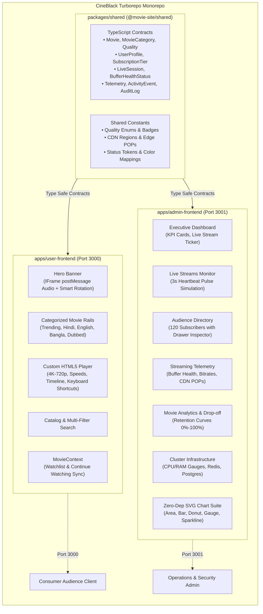

<div align="center">

# 🎬 CINEBLACK™

### Enterprise Cinema Streaming Platform & Operations Telemetry Monorepo
**Next.js 16 (App Router) • React 19 • TypeScript 5 • Tailwind CSS v4 • Turborepo 2**

<br />

[](https://nextjs.org/)
[](https://turbo.build/)
[](https://react.dev/)
[](https://www.typescriptlang.org/)
[](https://tailwindcss.com/)
[](LICENSE)

<br />

<p align="center">
  <strong>CineBlack</strong> is a high-performance, dual-application movie streaming monorepo built for the modern web. It pairs an immersive, OLED-optimized customer streaming experience with a mission-critical operations and real-time streaming telemetry dashboard.
</p>

<p align="center">
  <a href="#user-frontend"><strong>Explore User App (Port 3000)</strong></a> •
  <a href="#admin-frontend"><strong>Explore Admin Dashboard (Port 3001)</strong></a> •
  <a href="#quick-start"><strong>Quick Start</strong></a> •
  <a href="#architecture"><strong>Architecture</strong></a> •
  <a href="#chart-suite"><strong>SVG Chart Engine</strong></a>
</p>

</div>

---

## 📑 Table of Contents

- [Overview & Highlights](#overview)
- [Visual Interface Previews](#interface-previews)
- [System Architecture](#architecture)
- [Monorepo Directory Structure](#directory-structure)
- [Design Language: OLED Dark Cinema](#design-system)
- [Applications & Workspaces](#applications)
  - [1. User Streaming Platform (`apps/user-frontend`)](#user-frontend)
  - [2. Operations & Telemetry Dashboard (`apps/admin-frontend`)](#admin-frontend)
  - [3. Shared Data Models (`packages/shared`)](#shared-package)
- [Zero-Dependency Custom SVG Chart Suite](#chart-suite)
- [Technology Stack](#tech-stack)
- [Quick Start & Setup](#quick-start)
- [Workspace Command Reference](#scripts)
- [Route Catalog](#routes)
- [Dataset Specifications & Telemetry Engine](#datasets)
- [Key Engineering Implementations](#engineering)
- [Contributing & Code Conventions](#contributing)
- [License](#license)

---

<span id="overview"></span>
## 💎 Overview & Highlights

CineBlack reimagines modern digital entertainment infrastructure by establishing a clear architectural boundary between **customer-facing OTT media delivery** and **real-time platform operations & telemetry**:

* ⚡ **Turborepo 2.x Monorepo Architecture**: Zero-overhead npm workspaces with dependency isolation, intelligent task caching, and parallel build pipelines.
* 🌑 **OLED Pitch Black Aesthetic (`#050505`)**: Pure monochrome chrome designed for high contrast and zero light-bleed on OLED screens, letting vivid movie posters and media backdrops stand out with marquee brilliance.
* 🎬 **Intelligent Hero Trailer System**:
  - Direct **YouTube IFrame API integration via `postMessage`** enables instant volume adjustments and audio toggling with **zero video restarts or reloads**.
  - **Audio-aware carousel rotation**: If sound is muted, trailers rotate on a 25-second preview interval. If sound is enabled, the timer holds and advances automatically the millisecond the trailer finishes (`playerState === 0`).
* 📺 **Custom Cinema Video Player**:
  - Full-featured HTML5 player with multi-speed adjustment (`0.5x` to `2.0x`), resolution selector (`4K UHD`, `1080p`, `720p`), interactive timeline scrubber, and complete keyboard shortcut accessibility.
* 📊 **Enterprise Admin & Telemetry Suite**:
  - **14 dedicated operational views** delivering real-time viewer tracking, buffer health dials, global CDN edge POP analytics, audience directories, and cluster health monitoring.
* 📈 **Zero-Dependency SVG Chart Suite**:
  - Bespoke, high-performance charting components (Area, Bar, Donut, Semicircular Gauge, and Sparklines) with zero third-party dependencies, guaranteeing complete React 19 compatibility and zero layout shift.
* 💓 **Simulated Live Heartbeat Engine**:
  - Realistic 3-second heartbeat pulse simulation updating viewer playback positions, dynamic buffer depths, bitrates, and system events.

---

<span id="interface-previews"></span>
## 🖥️ Visual Interface Previews

### Customer Cinema Streaming (`apps/user-frontend` • Port 3000)
```text
┌────────────────────────────────────────────────────────────────────────────────────────┐
│  🎬 CINEBLACK           Home    Movies    Bangla    Hindi    Watchlist     [ 🔍 Search ]│
├────────────────────────────────────────────────────────────────────────────────────────┤
│  ▶ DUNE: PART TWO                                              [ 4K UHD ] [ ★ 8.6 ]   │
│  Paul Atreides unites with Chani and the Fremen while seeking revenge...               │
│                                                                                        │
│  [ ▶ Watch Now ]   [ + Watchlist ]           [ 🔊 Mute / Unmute ] [ ━━━●━━ 75% Vol ]   │
│                                                                                        │
│  CONTINUE WATCHING ──────────────────────────────────────────────────────────────────  │
│  ┌───────────────┐ ┌───────────────┐ ┌───────────────┐ ┌───────────────┐               │
│  │ Oppenheimer   │ │ Jawan         │ │ Hawa          │ │ Interstellar  │               │
│  │ [██████░░ 72%]│ │ [███░░░░░ 34%]│ │ [████████ 95%]│ │ [██░░░░░░ 20%]│               │
│  └───────────────┘ └───────────────┘ └───────────────┘ └───────────────┘               │
│                                                                                        │
│  TRENDING CINEMA RAILS ──────────────────────────────────────────────────────────────  │
│  [ Hindi Cinema ]    [ International Hits ]    [ Bangla Classics ]    [ Hindi Dubbed ] │
└────────────────────────────────────────────────────────────────────────────────────────┘
```

### Operations & Telemetry Dashboard (`apps/admin-frontend` • Port 3001)
```text
┌────────────────────────────────────────────────────────────────────────────────────────┐
│ 🎬 CINEBLACK OPS    [● Cluster Healthy • 99.98%]     [ 🔍 Filter Telemetry ]   [ Admin ]│
├─────────────────┬──────────────────────────────────────────────────────────────────────┤
│ 📊 Dashboard    │  TOTAL SUBSCRIBERS    ACTIVE STREAMS    BUFFER HEALTH    BANDWIDTH   │
│ 👥 Audience     │  120                 14 Active (3s)    32.4s (Optimal)  4.82 TB     │
│ 📡 Live Stream  │  ▲ +14.2% MoM        ▲ +8.4% Live      ● 98.2% Healthy  ▲ +19.1%    │
│ 🎥 Catalog      ├──────────────────────────────────────────────────────────────────────┤
│ 📉 Retention    │  CONCURRENT STREAMS (24-HOUR VELOCITY)                               │
│ ⚡ Telemetry    │   ▂▃▅▆▇██▇▆▅▄▃▂▂▃▅▆▇██   [Hover crosshair: 1,840 Total • 480 4K UHD] │
│ 💻 Devices      ├──────────────────────────────────────────────────────────────────────┤
│ 🌐 Geographic   │  ACTIVE SESSIONS (3S HEARTBEAT)         GLOBAL CDN POP HEALTH        │
│ 🔍 Search Intel │  • user_ashburn: Dune 2 (4K • 38s buf)  • Ashburn IAD:  12ms (99.8%) │
│ ⚙️ System Ops   │  • user_dhaka:   Hawa   (HD • 24s buf)  • Dhaka DAC:    22ms (99.4%) │
└─────────────────┴──────────────────────────────────────────────────────────────────────┘
```

---

<span id="architecture"></span>
## 🏛 System Architecture

The following diagram illustrates the monorepo topology, shared TypeScript contract distribution, and dual-client runtime delivery:



---

<span id="directory-structure"></span>
## 📁 Monorepo Directory Structure

```text
movie-site/
├── apps/
│   ├── user-frontend/                 # Consumer Streaming OTT Platform (Port 3000)
│   │   ├── app/
│   │   │   ├── layout.tsx             # Root layout with MovieProvider, Navbar, and Footer
│   │   │   ├── page.tsx               # Home with HeroBanner, Continue Watching, and 7 Rails
│   │   │   ├── movies/page.tsx        # Catalog with category tabs, genre chips, and live search
│   │   │   ├── movie/[id]/page.tsx    # Film details, metadata, trailer lightbox, and recommendations
│   │   │   ├── watch/[id]/page.tsx    # Custom cinematic player with keyboard controls
│   │   │   ├── search/page.tsx        # Instant search filtering across title, cast, and director
│   │   │   ├── watchlist/page.tsx     # Saved movies stored locally in browser
│   │   │   └── profile/page.tsx       # Subscriber profile, watch stats, and history management
│   │   ├── components/
│   │   │   ├── HeroBanner.tsx         # Background YouTube trailer autoplay & smart rotation
│   │   │   ├── VideoPlayer.tsx        # HTML5 cinema player with scrubber preview & speed controls
│   │   │   ├── MovieCard.tsx          # Colorful poster card with decoupled hover actions
│   │   │   ├── MovieRow.tsx           # Smooth horizontal scrollable carousel rail
│   │   │   ├── ContinueWatchingRow.tsx# Resume playback rail with progress bars
│   │   │   ├── Navbar.tsx             # Sticky blurred navigation with category links
│   │   │   └── Footer.tsx             # Clean minimal footer with platform metadata
│   │   ├── context/
│   │   │   └── MovieContext.tsx       # LocalStorage state management
│   │   ├── data/
│   │   │   └── movies.ts              # 54 rich movie records across 4 categories
│   │   ├── package.json
│   │   └── tsconfig.json
│   │
│   └── admin-frontend/                # Operations & Streaming Telemetry Dashboard (Port 3001)
│       ├── app/
│       │   ├── layout.tsx             # Admin shell with collapsible sidebar & header
│       │   ├── page.tsx               # 1. Main Dashboard (KPIs, stream trends, live ticker)
│       │   ├── users/page.tsx         # 2. Audience Directory (120 subscribers, filters, drawer)
│       │   ├── user-activity/page.tsx # 3. User Activity (220 real-time playback/auth events)
│       │   ├── live-sessions/page.tsx # 4. Live Sessions (3s heartbeat pulse simulation)
│       │   ├── movies/page.tsx        # 5. Movies Catalog (54 films, quality filter, inspector)
│       │   ├── movie-analytics/page.tsx # 6. Retention Drop-off curves & category comparisons
│       │   ├── categories/page.tsx    # 7. Category Breakdowns (Hindi, English, Bangla, Dubbed)
│       │   ├── telemetry/page.tsx     # 8. Streaming Telemetry (TTFB, buffer health, CDN POPs)
│       │   ├── devices/page.tsx       # 9. Hardware form factors, browsers, OS, resolutions
│       │   ├── geographic/page.tsx    # 10. Geographic Analytics (18 countries & hub cities)
│       │   ├── search-analytics/page.tsx # 11. Search queries, zero-result terms, funnel
│       │   ├── system-health/page.tsx # 12. Cluster nodes, PostgreSQL, Redis, API latency
│       │   ├── logs/page.tsx          # 13. Administrative Security Audit Trail
│       │   └── settings/page.tsx      # 14. Bitrate caps, codecs, cache TTL, maintenance mode
│       ├── components/
│       │   ├── AdminSidebar.tsx       # Collapsible navigation with all 14 links & live count
│       │   ├── AdminHeader.tsx        # Topbar with global cluster health badge & alerts
│       │   ├── StatCard.tsx           # KPI card with trendline sparkline
│       │   ├── DataTable.tsx          # Searchable, filterable, sortable, paginated table
│       │   └── charts/                # Zero-dependency SVG Chart Suite
│       │       ├── AreaChart.tsx      # Dual-series gradient area chart with crosshair tracker
│       │       ├── BarChart.tsx       # Rounded column chart with category colors
│       │       ├── DonutChart.tsx     # Circular distribution with interactive segments
│       │       ├── GaugeChart.tsx     # Semicircular buffer health / resource dials
│       │       └── Sparkline.tsx      # Inline velocity sparklines for KPI cards
│       ├── data/                      # Structured mock datasets (users, sessions, telemetry)
│       ├── package.json
│       └── tsconfig.json
│
├── packages/
│   └── shared/                        # Shared TypeScript Contracts & Domain Models
│       ├── src/
│       │   ├── types.ts               # Shared interfaces (Movie, User, Session, Telemetry)
│       │   ├── constants.ts           # Categories, qualities, CDN regions, status badges
│       │   └── index.ts               # Package entry point
│       ├── package.json
│       └── tsconfig.json
│
├── package.json                       # Turborepo root workspace configuration
├── turbo.json                         # Turborepo task pipeline & caching definitions
└── README.md                          # Platform documentation
```

---

<span id="design-system"></span>
## 🎨 Design Language: OLED Dark Cinema

CineBlack utilizes a bespoke, contrast-engineered **OLED Dark Cinema** design system. The user interface remains deliberately monochrome and minimalist so that high-resolution film artwork, movie posters, and high-definition video streams command complete visual priority.

| Token | Hex / Value | Description & Application |
|---|---|---|
| **True OLED Canvas** | `#050505` | Canvas background; produces zero light bleed on OLED and Mini-LED displays. |
| **Surface Base** | `#0c0c0c` | Primary surface for cards, data tables, and navigation bars. |
| **Surface Raised** | `#121212` | Elevated cards, sidebars, modal surfaces, and drawer inspectors. |
| **Surface Overlay** | `#181818` | Floating tooltips, context menus, and active interactive controls. |
| **Border Subtle** | `#1c1c1c` | Hairline dividers and table column separators (`1px solid`). |
| **Border Moderate** | `#262626` | Card outlines, input fields, and hover highlight strokes. |
| **Primary Typography** | `#ffffff` | Headers, KPI values, high-contrast labels, and movie titles. |
| **Secondary Typography** | `#a1a1aa` | Subheadings, metadata descriptions, and secondary metrics. |
| **Muted Typography** | `#71717a` | Timestamps, table footers, and inactive indicators. |
| **Media Artwork** | *100% Vibrant* | Movie posters, backdrops, and video streams retain full, rich color. |
| **Status Accents** | Emerald, Amber, Rose | Semantic indicators for platform health (`Healthy`, `Warning`, `Degraded`). |

---

<span id="applications"></span>
## 📦 Applications & Workspaces

<span id="user-frontend"></span>
### 1. `apps/user-frontend`: Customer Streaming (Port 3000)

The customer-facing OTT platform delivering cinematic movie discovery, playback, and personal collection management.

#### Key Features:
* **Zero-Restart YouTube Trailer Integration**: Hero trailer playback autoplays silently in high resolution. Unmuting or adjusting the volume slider directly communicates with the YouTube player via `postMessage`, adjusting the audio level **without causing the video to restart or buffer**.
* **Audio-Aware Smart Rotation**:
  * **Muted**: Slides rotate every 25 seconds across featured cinema titles.
  * **Audio Enabled**: The rotation timer pauses while the user listens, advancing to the next film automatically the exact moment the trailer finishes (`playerState === 0`).
* **Categorized Movie Rails**: Smooth, mouse-drag and wheel-scrollable carousels for *Trending Now, Hindi Cinema, International Hits, Bangla Classics, Hindi Dubbed, High Rated, and Action & Thrillers*.
* **Custom Hardware-Accelerated Video Player**:
  * Built-in multi-speed playback engine (`0.5x`, `1.0x`, `1.25x`, `1.5x`, `2.0x`).
  * Resolution switcher (`4K UHD`, `1080p`, `720p`) with visual quality badge.
  * Interactive time-scrubber with hover time preview.
* **LocalStorage Synchronization**: Instant client-side persistence for the user's **Watchlist** and **Continue Watching** progress bar without requiring backend authentication.
* **Instant Discovery Engine**: Search across 54 films by title, genre, director, starring cast, and language with instant debounced filtering.

#### Player Keyboard Shortcuts:

| Shortcut | Action | Details |
|---|---|---|
| <kbd>Space</kbd> / <kbd>K</kbd> | Play / Pause | Instantly toggles video playback state |
| <kbd>→</kbd> / <kbd>L</kbd> | Seek Forward | Advances timeline by +10 seconds |
| <kbd>←</kbd> / <kbd>J</kbd> | Seek Backward | Rewinds timeline by -10 seconds |
| <kbd>↑</kbd> | Volume Up | Increases audio gain by +10% |
| <kbd>↓</kbd> | Volume Down | Decreases audio gain by -10% |
| <kbd>M</kbd> | Toggle Mute | Silences or restores audio stream |
| <kbd>F</kbd> | Fullscreen | Toggles browser full-screen video mode |

---

<span id="admin-frontend"></span>
### 2. `apps/admin-frontend`: Operations & Telemetry (Port 3001)

An operations and telemetry dashboard providing deep real-time visibility across the entire streaming platform.

#### 14 Operational Modules:

1. **Dashboard Overview (`/`)**: High-level platform KPIs (Total Users, Active Streams, Bandwidth, 24h Watch Hours) with area trendlines and a live stream ticker.
2. **Audience Directory (`/users`)**: 120 fictional subscribers with multi-parameter filtering (tier, status, country), search, sorting, and a slide-over drawer inspector showing user playback history.
3. **User Activity Stream (`/user-activity`)**: 220 granular playback, authentication, and security audit events with real-time classification badges.
4. **Live Sessions Monitor (`/live-sessions`)**: Active streams with an autonomous 3-second simulation engine modulating viewer progress, buffer depths, bitrates, and heartbeats.
5. **Movie Catalog Operations (`/movies`)**: 54-film inventory management with quality filters, IMDb ratings, runtimes, and movie inspection modals.
6. **Movie Analytics & Retention (`/movie-analytics`)**: Granular viewer retention drop-off curves (0% intro through 100% credits), completion rates, and average watch durations.
7. **Category Analytics (`/categories`)**: Comparative metrics across Hindi, English, Bangla, and Hindi Dubbed catalogs (view counts, watch hours, and revenue share).
8. **Streaming Telemetry (`/telemetry`)**: Deep stream health telemetry including Time to First Byte (TTFB), semicircular buffer health gauges, and edge hit-rates across global CDN POPs.
9. **Device Analytics (`/devices`)**: Hardware breakdown across Smart TVs (OLED, Apple TV), Desktop browsers (Chrome, Safari, Edge), mobile operating systems, and viewport resolutions.
10. **Geographic Distribution (`/geographic`)**: Regional viewer densities, data bandwidth consumption, and streaming quality distribution across 18 countries.
11. **Search Analytics (`/search-analytics`)**: Top search terms, zero-result queries, search-to-watch conversion funnels, and discovery drop-offs.
12. **Infrastructure Health (`/system-health`)**: Cluster node utilization (CPU, Memory, Disk), API gateway latency percentiles, Redis cache hit-ratios, and PostgreSQL connection pool stats.
13. **Security Audit Log (`/logs`)**: Immutable administrative activity trail logging permission updates, catalog edits, and configuration changes.
14. **Platform Settings (`/settings`)**: Stream configuration controls (bitrate ceilings, default codecs, cache TTLs, maintenance mode toggles).

---

<span id="shared-package"></span>
### 3. `packages/shared`: Shared Domain Contracts

A dedicated workspace package (`@movie-site/shared`) ensuring end-to-end type safety between the consumer app and admin telemetry:

* **Movie Domain**: `Movie`, `MovieCategory`, `MovieQuality`, `WatchProgress`
* **User Domain**: `UserProfile`, `UserSubscriptionTier`, `UserStatus`
* **Streaming Telemetry**: `LiveSession`, `BufferHealthStatus`, `StreamConnectionStatus`, `StreamingTelemetrySummary`
* **Activity & Audit**: `UserActivityEvent`, `ActivityEventType`, `AuditLogEntry`
* **System Operations**: `SystemHealthMetrics`, `SystemEventLog`, `SearchQueryStat`, `ZeroResultQuery`
* **Constants**: Categorized rails, supported resolutions, global CDN edge locations, and status color tokens.

---

<span id="chart-suite"></span>
## 📊 Zero-Dependency Custom SVG Chart Suite

To avoid React 19 peer-dependency conflicts and prevent layout shifts, CineBlack includes a custom, zero-dependency SVG charting engine built into `apps/admin-frontend/components/charts/`:

```
apps/admin-frontend/components/charts/
├── AreaChart.tsx     # Dual-series gradient area chart with crosshair tracker
├── BarChart.tsx      # Rounded column chart with category colors
├── DonutChart.tsx    # Circular distribution with interactive segments
├── GaugeChart.tsx    # Semicircular buffer health / resource dials
└── Sparkline.tsx     # Inline velocity sparklines for KPI cards
```

### Chart Component Technical Specifications:

| Component | Visual Presentation | Engineering Solutions & Features |
|---|---|---|
| **`AreaChart.tsx`** | Dual-series gradient fill with glow stroke | **Full-Canvas Crosshair Tracking**: Uses a continuous SVG overlay rect to mathematically snap to the nearest data point. Eliminates hover seam dead-zones. Floating glass tooltip card utilizes `pointerEvents="none"` to prevent mouse-leave flickering loops. Fixed-height header eliminates layout shifts. |
| **`BarChart.tsx`** | Rounded vertical column bars with gridlines | Dynamic column heights mapped to data maxima. Category color accents with hover tooltips and stable metric headers. |
| **`DonutChart.tsx`** | Circular SVG distribution with center readout | Normalized stroke dash-array offsets. Dynamic segment hover highlight with interactive legends and central metric readout. |
| **`GaugeChart.tsx`** | Semicircular dial indicator | Math-driven arc stroke calculation (`strokeDasharray` / `strokeDashoffset`). Semantic color thresholding (Emerald > 80%, Amber > 50%, Rose < 50%). |
| **`Sparkline.tsx`** | Compact inline polyline | Embedded inside KPI cards. Normalized polyline path computation with area gradient fill for rapid 7-day trend visualization. |

---

<span id="tech-stack"></span>
## 🛠 Technology Stack

| Layer | Technology | Version | Purpose |
|---|---|---|---|
| **Monorepo Engine** | [Turborepo](https://turbo.build/) | `^2.11.3` | Multi-package workspace orchestration, task pipelines, and caching |
| **Framework** | [Next.js](https://nextjs.org/) | `16.3.6` | React framework with App Router, SSR, and dynamic route segments |
| **UI Library** | [React](https://react.dev/) | `19.2.8` | Component rendering, concurrent features, and hooks |
| **Language** | [TypeScript](https://www.typescriptlang.org/) | `^5.0.0` | Strict static typing, unified domain interfaces, and compile safety |
| **Styling** | [Tailwind CSS](https://tailwindcss.com/) | `^4.0.0` | Utility-first styling with modern PostCSS pipeline integration |
| **Icons** | [Lucide React](https://lucide.dev/) | `^1.47.0` | Minimal, high-contrast iconography for cinema controls and ops |
| **Media Player** | Custom HTML5 Video Player | Native | Custom playback rate, resolution switcher, and timeline scrubber |
| **Streaming APIs** | YouTube IFrame API | `postMessage` | Background trailer streaming with zero-reload audio control |
| **Package Manager** | npm Workspaces | `11.6.4` | Workspace dependency management and package linking |

---

<span id="quick-start"></span>
## ⚡ Quick Start & Setup

### Prerequisites
* **Node.js**: `v20.x` or higher (LTS recommended)
* **npm**: `v10.x` or higher (`npm@11.6.4` recommended)

### 1. Clone & Install

```bash
# Clone the repository
git clone https://github.com/SOUROV/movie-site.git
cd movie-site

# Install all workspace dependencies via npm
npm install
```

### 2. Start Development Servers

To launch both the consumer streaming app and the operations telemetry dashboard concurrently:

```bash
npm run dev
```

Turborepo will automatically launch both applications in parallel:

| Application | Workspace | Local URL | Description |
|---|---|---|---|
| **User Streaming Platform** | `apps/user-frontend` | [http://localhost:3000](http://localhost:3000) | Consumer OTT cinema experience |
| **Operations Telemetry Admin** | `apps/admin-frontend` | [http://localhost:3001](http://localhost:3001) | Real-time monitoring & ops dashboard |

---

<span id="scripts"></span>
## 🔧 Workspace Command Reference

All operational commands can be executed directly from the root repository:

```bash
# Development
npm run dev              # Run both user-frontend (:3000) and admin-frontend (:3001) in parallel
npm run dev:user         # Launch only the customer streaming application (Port 3000)
npm run dev:admin        # Launch only the operations telemetry dashboard (Port 3001)

# Production Builds
npm run build            # Build all workspaces in parallel with Turborepo caching
npm run build:user       # Build only user-frontend
npm run build:admin      # Build only admin-frontend

# Quality & Linting
npm run lint             # Run ESLint verification across all packages and apps
```

---

<span id="routes"></span>
## 🗺 Route Catalog

### Customer Streaming Platform (`user-frontend` • Port 3000)

| Route | Page Name | Primary Features & Components |
|---|---|---|
| `/` | **Cinema Home** | Hero banner with YouTube trailer, smart rotation, continue watching rail, and 7 category rails. |
| `/movies` | **Movie Catalog** | Full 54-film grid with category tabs (All, Hindi, English, Bangla, Dubbed), genre filters, and search. |
| `/movie/[id]` | **Movie Details** | Film synopsis, cast, director, HD/4K badges, trailer modal, and recommendation carousel. |
| `/watch/[id]` | **Cinema Player** | Custom video player with multi-speed controls, 4K resolution switcher, scrubber, and keyboard shortcuts. |
| `/search` | **Search Engine** | Real-time debounced query search across titles, actors, directors, genres, and languages. |
| `/watchlist` | **Saved Watchlist** | User's saved cinema collection stored locally in the browser with one-click remove. |
| `/profile` | **Subscriber Profile** | Profile statistics, total watch hours, subscription tier display, and watch history clearing. |

### Operations & Telemetry Dashboard (`admin-frontend` • Port 3001)

| Route | Module Name | Primary Telemetry & Views |
|---|---|---|
| `/` | **Dashboard** | Total users, active streams, bandwidth, 24h watch hours, stream trends, and live activity ticker. |
| `/users` | **Audience Directory** | 120 subscribers with tier badges, status chips, multi-filter search, and slide-over user drawer. |
| `/user-activity` | **User Activity Stream** | 220 granular playback, auth, and security events with timestamped filterable table. |
| `/live-sessions` | **Live Sessions** | Active streams with 3s heartbeat pulse simulation (buffer health, bitrate, time elapsed). |
| `/movies` | **Catalog Operations** | 54-film inventory with quality filters, IMDb ratings, runtimes, and movie inspection modals. |
| `/movie-analytics` | **Retention Analytics** | Granular viewer drop-off curves (0% to 100%), average watch duration, and completion rates. |
| `/categories` | **Category Performance**| Comparative view counts, watch hours, and revenue share across Hindi, English, Bangla, and Dubbed. |
| `/telemetry` | **Streaming Telemetry** | TTFB metrics, semicircular buffer health gauges, and edge hit-rates across global CDN POPs. |
| `/devices` | **Device Analytics** | Breakdown across Smart TVs, desktop browsers, mobile operating systems, and viewport resolutions. |
| `/geographic` | **Geographic Insights** | Regional viewer densities, data bandwidth consumption, and streaming quality distribution across 18 countries. |
| `/search-analytics`| **Search Discovery** | Top searched terms, zero-result queries, search-to-watch conversion funnels, and drop-offs. |
| `/system-health` | **Cluster Health** | Node CPU/RAM gauges, API latency percentiles, Redis cache hit-ratios, and Postgres connection stats. |
| `/logs` | **Security Audit Log** | Immutable administrative activity trail logging catalog edits, config updates, and access events. |
| `/settings` | **Platform Config** | Bitrate ceilings, default video codecs, CDN cache TTLs, and platform maintenance mode switches. |

---

<span id="datasets"></span>
## 📈 Dataset Specifications & Telemetry Engine

The CineBlack monorepo includes comprehensive mock data modeling real-world streaming platform conditions without requiring an external database:

* **54 Feature Films (`mockMovies.ts`)**: Authentic titles spanning Hindi, English, Bangla, and Hindi Dubbed with official TMDB poster artwork, backdrop banners, release years, IMDb ratings, and synopsis metadata.
* **120 Subscriber Profiles (`mockUsers.ts`)**: Fictional user accounts with geographic coordinates, registered devices (Apple TV, LG OLED, Sony Bravia, MacBook Pro, iPhone, Galaxy), and subscription tiers (*Free, Standard HD, Premium 4K, Family VIP*).
* **220 Activity Events (`mockActivities.ts`)**: Granular activity logs covering video starts, pauses, seeks, quality modifications, completed streams, and search actions.
* **3-Second Live Session Heartbeat**: `/live-sessions` features an autonomous pulse engine that updates session positions, modulates buffer depths (8s to 45s), adjusts bitrates, and dynamically timestamps heartbeats.
* **Global CDN Edge Topology**: Simulated metrics across 8 worldwide edge locations: *Ashburn (US-East), San Jose (US-West), Frankfurt (EU-Central), London (EU-West), Mumbai (AP-South), Dhaka (AP-South-2), Singapore (AP-East), and Sydney (AP-Southeast)*.

---

<span id="engineering"></span>
## 💡 Key Engineering Implementations

### 1. Zero-Restart Audio Control via YouTube `postMessage`

When users adjust the volume or toggle mute in the hero banner, standard iframe reloads restart the video from second 0. CineBlack solves this by communicating directly with the YouTube HTML5 Player API over the window messaging bus:

```typescript
// apps/user-frontend/components/HeroBanner.tsx
const sendPlayerCommand = (func: string, args: any[] = []) => {
  if (iframeRef.current && iframeRef.current.contentWindow) {
    iframeRef.current.contentWindow.postMessage(
      JSON.stringify({ event: 'command', func, args }),
      '*'
    );
  }
};

// Toggle mute without reloading iframe
sendPlayerCommand(isMuted ? 'unMute' : 'mute');

// Set volume dynamically (0-100) without reloading iframe
sendPlayerCommand('setVolume', [newVolume]);
```

### 2. Audio-Aware Carousel Transition Timing

```typescript
// Pause rotation timer if user has unmuted audio
useEffect(() => {
  if (!isMuted) return; // Holds current slide while trailer audio is active

  const timer = setInterval(() => {
    handleNext();
  }, 25000);

  return () => clearInterval(timer);
}, [currentIndex, isMuted]);

// Listen for YouTube player state changes via window postMessage
useEffect(() => {
  const handleMessage = (event: MessageEvent) => {
    try {
      const data = typeof event.data === 'string' ? JSON.parse(event.data) : event.data;
      // playerState === 0 indicates trailer playback completed
      if (data?.event === 'onStateChange' && data?.info === 0) {
        handleNext(); // Immediately advance carousel on trailer finish
      }
    } catch {}
  };
  window.addEventListener('message', handleMessage);
  return () => window.removeEventListener('message', handleMessage);
}, [currentIndex]);
```

### 3. Full-Canvas Crosshair Tracking in `AreaChart.tsx`

To eliminate hover seam gaps and flickering mouse-leave loops, the chart overlays a transparent full-canvas tracking rectangle:

```typescript
// apps/admin-frontend/components/charts/AreaChart.tsx
const handleMouseMove = (e: React.MouseEvent<SVGSVGElement>) => {
  const rect = e.currentTarget.getBoundingClientRect();
  const mouseX = e.clientX - rect.left - padding.left;
  const step = chartWidth / (data.length - 1);
  const index = Math.max(0, Math.min(data.length - 1, Math.round(mouseX / step)));
  setHoveredIndex(index);
};

// Overlay covers the entire SVG canvas:
<rect
  x={0}
  y={0}
  width={width}
  height={height}
  fill="transparent"
  className="cursor-crosshair"
  onMouseMove={handleMouseMove}
  onMouseLeave={() => setHoveredIndex(null)}
/>
```

---

<span id="contributing"></span>
## 🤝 Contributing & Code Conventions

1. **Branch Naming**:
   - `feature/feature-name` for new user or admin features
   - `fix/issue-description` for bug fixes
   - `perf/optimization` for performance improvements
2. **Commit Convention**: Follow Conventional Commits:
   - `feat(user): add audio waveform visualizer to hero trailer`
   - `feat(admin): add latency heat map to streaming telemetry`
   - `fix(charts): eliminate tooltip flicker on high-DPI displays`
3. **Workspace Boundaries**: Never import directly across `apps/`. Share data models, types, and constants via `packages/shared`.

---

<span id="license"></span>
## 📄 License

This project is licensed under the [MIT License](LICENSE) - feel free to use it for personal and commercial projects.

<div align="center">
  <br />
  <sub>Built with precision for cinema enthusiasts and streaming operations teams.</sub>
</div>
